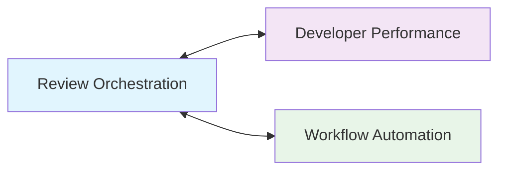
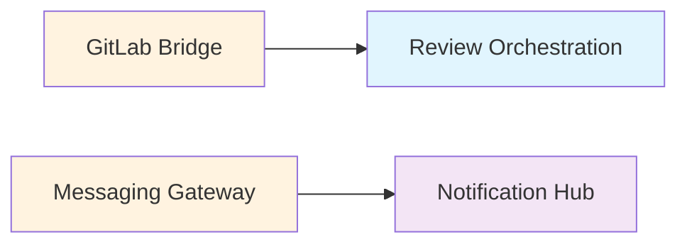
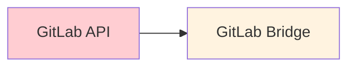
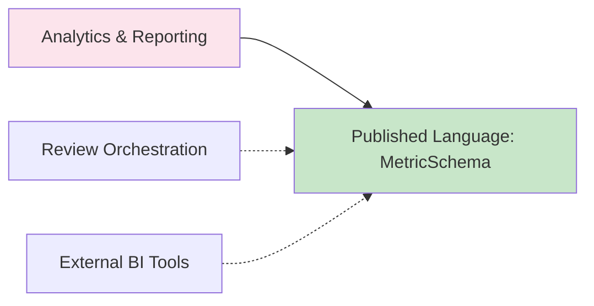

## **Видение и принципы**

**Главная цель:** Устранить узкое горло code review через справедливое автоматизированное назначение и прозрачную метрику.

**Ключевые принципы:**
1. **Автоматизация с человеческим контролем** — бот принимает рутинные решения, люди могут вмешаться
2. **Справедливость через прозрачность** — алгоритмы понятны, статистика открыта
3. **Инкрементальная сложность** — от простого круг-робин к умному назначению
4. **Данные как актив** — всё что измеряется, используется для улучшения процесса

---

## **Карта контекстов (Context Map)**

### **Core Domains (Ядерные домены)**

#### **1. Review Orchestration Context**
*Управление жизненным циклом ревью, стратегии назначения, координация*
```
Ответственность:
- Создание ReviewSession при новом MR
- Выбор стратегии назначения (simple → smart → expert) (вне MVP)
- Координация между всеми контекстами
- Обработка эскалаций и исключений

Язык:
- ReviewSession, AssignmentStrategy, SessionStatus
- "Сессия ревью", "Стратегия назначения", "Эскалация"

Анти-паттерн:
НЕ содержит логику уведомлений, НЕ содержит данные разработчиков
```

#### **2. Developer Performance Context**  
*Учёт, развитие и мотивация разработчиков как ревьюеров*
```
Ответственность:
- Профили разработчиков
- Рейтинговая система (качество + скорость) (вне MVP)
- Категории компетенций (frontend/backend/security/etc) (вне MVP)
- Индивидуальные лимиты и правила (В рамках MVP  - фокусное окно)

Язык:
- DeveloperProfile, ReviewerRank, CompetencyMatrix
- "Ревьювер уровня Senior", "Эксперт по TypeScript"
```

### **Supporting Domains (Поддерживающие домены)**

#### **3. Notification Hub Context**
*Интеллектуальная система уведомлений и напоминаний*
```
Ответственность:
- Персональные правила уведомлений (как, когда, куда)
- Адаптивная частота напоминаний
- Каналы коммуникации (вне MVP)
- Шаблоны сообщений с контекстом

Язык:
- NotificationPolicy, ReminderStrategy, ChannelPriority
- "Тихий режим после 18:00", "Срочное уведомление"
```

#### **4. Workflow Automation Context**
*Оркестрация процессов и таймингов*
```
Ответственность:
- Управление дедлайнами и SLA
- Автоматические переходы состояний
- Обработка таймаутов и повторных попыток
- Интеграция с календарями (отпуска, встречи) (вне MVP) 

Язык:
- Workflow, DeadlinePolicy, EscalationPath
- "SLA 4 часа", "Авто-эскалация к тимлиду"
```

### **Generic Domains (Общие домены)**

#### **5. Analytics & Reporting Context (вне MVP)**
*Сбор, анализ и визуализация метрик*
```
Ответственность:
- Реальное время: дашборды для команды
- Исторические данные: тренды и отчёты
- Прогнозы: нагрузка, время review
- Экспорт для Performance Review

Язык:
- MetricDashboard, TrendAnalysis, PerformanceReport
- "Среднее время ревью", "Коэффициент загрузки"
```

### **Anti-Corruption Layers (Защитные слои)**

#### **6. GitLab Bridge Context**
*Двусторонняя синхронизация с GitLab*
```
Ответственность:
- Получение событий через веб-хуки
- Отправка аппрувов/комментариев
- Синхронизация статусов
- Обработка расхождений

Язык:
- WebhookAdapter, GitLabSync, MergeRequestProxy
- "Событие создания MR", "Синхронизация статуса"
```

#### **7. Messaging Gateway Context**
*Унифицированный интерфейс для мессенджеров*
```
Ответственность:
- Абстракция над API Пачки
- Обработка интерактивных элементов
- Очередь и ретраи сообщений
- Мониторинг доставки

Язык:
- MessageGateway, ButtonAction, DeliveryReceipt
- "Кнопка подтверждения", "Статус доставки"
```

---

## **Стратегические паттерны взаимодействия**

### **1. Контексты-партнёры (Partnerships)**

*Совместная эволюция, частые изменения API*

### **2. Клиент-поставщик (Customer-Supplier)**

*Поставщик удовлетворяет потребности клиента*

### **3. Конформисты (Conformist)**

*Мы подстраиваемся под модель GitLab*

### **4. Открытый сервис (Open Host Service)**

*Стандартизированный API для аналитики*

---

## **Эволюционная стратегия**

### **Фаза 1: MVP (1-2 месяца)**
```
Контексты:
┌─────────────────────────────────────┐
│  Review Orchestration (упрощённый)  │
│  GitLab Bridge (базовый)            │
│  Messaging Gateway     │
└─────────────────────────────────────┘

Стратегия назначения: Round-robin
Уведомления: Базовые, без персонализации
Статистика: Счётчики в базе данных
```

### **Фаза 2: Расширение (3-4 месяца)**
```
Новые контексты:
┌─────────────────────────────────────┐
│  Developer Performance (базовый)    │
│  Workflow Automation (таймеры)      │
│  Notification Hub (шаблоны)         │
└─────────────────────────────────────┘

Стратегия: Нагрузка + простые компетенции
Уведомления: Адаптивные напоминания
Статистика: Дашборд для команды
```

### **Фаза 3: Оптимизация (5-6 месяцев)**
```
Новые контексты:
┌─────────────────────────────────────┐
│  Analytics & Reporting (полный)     │
│  Developer Performance (продвинутый)│
└─────────────────────────────────────┘

Стратегия: ML-рекомендации
Уведомления: Контекстно-зависимые
Статистика: Прогнозы и рекомендации
```

### **Фаза 4: Экосистема (7+ месяцев)**
```
Интеграции:
┌─────────────────────────────────────┐
│  Jira/Tempo (планирование)          │
│  HR Systems (оценка)                │
│  Learning Platforms (развитие)      │
└─────────────────────────────────────┘

Стратегия: Полный контекст разработчика
Уведомления: Мультиканальные
Статистика: 360° анализ эффективности
```

---

## **Принципы проектирования границ**

### **1. Разделение по темпу изменений**
- **Быстро меняется:** Стратегии назначения, шаблоны уведомлений
- **Медленно меняется:** Модель разработчика, SLA политики
- **Очень медленно:** Форматы интеграции с GitLab

### **2. Разделение по командам ответственности**
- **Команда ядра:** Review Orchestration + Developer Performance
- **Команда инфраструктуры:** GitLab Bridge + Messaging Gateway
- **Команда аналитики:** Analytics & Reporting
- **Команда UX:** Notification Hub + Workflow Automation

### **3. Разделение по масштабируемости**
- **Вертикальное масштабирование:** Analytics & Reporting (тяжёлые запросы)
- **Горизонтальное масштабирование:** Messaging Gateway (много сообщений)
- **Региональное масштабирование:** Notification Hub (часовые пояса)

---

## **Ключевые интеграционные точки**

### **Событийная шина (Event Bus)**
```typescript
// Все контексты публикуют события в общую шину
interface DomainEvent {
  context: string;          // Источник события
  type: string;            // Тип события
  payload: any;            // Данные
  correlationId: string;   // Идентификатор корреляции
  timestamp: Date;         // Когда произошло
}

// Примеры событий:
- "review_orchestration.reviewer_assigned"
- "developer.entered_focus_mode" 
- "gitlab.mr_approved"
- "analytics.review_completed"
```

### **Общий глоссарий (Shared Kernel)**
```typescript
// Разделяемые между контекстами понятия
interface SharedConcepts {
  // Идентификаторы
  DeveloperId: string;     // Уникальный ID разработчика
  ReviewSessionId: string; // ID сессии ревью
  MRId: string;           // ID MR в GitLab
  
  // Статусы
  ReviewStatus: "searching" | "assigned" | "in_review" | "completed";
  DeveloperStatus: "available" | "focus_mode" | "vacation" | "ooo";
  
  // Временные интервалы
  TimeInterval: {
    start: Date;
    end: Date;
    duration: number; // в часах
  };
}
```

### **API Gateway паттерн**
```
Внешний мир → API Gateway → Соответствующий контекст
            ↓
        [Аутентификация]
        [Авторизация]  
        [Логирование]
        [Rate Limiting]
```

---

## **Управление консистентностью**

### **Сильная консистентность (внутри контекста)**
- Состояние ReviewSession
- Профиль разработчика
- Активные таймеры

### **Слабая консистентность (между контекстами)**
```typescript
// Eventual consistency через события
Review Orchestration публикует "reviewer_assigned"
↓ (async, может быть задержка до 1 мин)
Notification Hub получает и отправляет уведомление
↓ (async, может быть задержка до 30 сек)
Analytics обновляет статистику
```

### **Компенсирующие транзакции**
```typescript
// Если уведомление не доставлено
1. Notification Hub фиксирует ошибку
2. Публикует "notification_failed"
3. Review Orchestration получает
4. Возвращает сессию в статус "searching"
5. Ищет нового ревьювера
```

---

## **Мониторинг границ контекстов**

### **Метрики для каждой границы:**
1. **Задержка событий** между контекстами
2. **Частота отказов** API вызовов
3. **Объём данных** передаваемый через границу
4. **Количество версий** контрактов API

### **Дашборд контекстной карты:**
```
┌─────────────────────────────────────────────┐
│  Контекст          │  События/мин │  Ошибки │
├─────────────────────────────────────────────┤
│  Review Orchestration │     12      │   0.1%  │
│  Developer Performance│      5      │   0.3%  │
│  Notification Hub     │     45      │   2.1%  │  ← Проблема!
│  GitLab Bridge       │      8      │   0.5%  │
└─────────────────────────────────────────────┘
```

---

## **Эволюция языка предметной области**

### **Текущий язык (MVP):**
```
MR → Review → Assign → Approve/Reject → Complete
```

### **Целевой язык (через 1 год):**
```
Code Contribution → Review Opportunity → Expert Matching → 
→ Collaborative Review → Quality Gate → Learning Opportunity
```

### **Изменения в терминологии:**
- "Merge Request" → "Code Contribution" (более широко)
- "Reviewer" → "Review Partner" (коллаборативный подход)
- "Approve" → "Quality Gate Passed" (фокус на качестве)
- "Comment" → "Learning Point" (фокус на развитии)

---

## **Стратегические риски и митигация**

### **Риск 1: Сопротивление команды**
```
Митигация:
- MVP только с базовым круг-робин
- Опциональное использование первое время
- Быстрая обратная связь и адаптация
```

### **Риск 2: Перегрузка инфраструктуры**
```
Митигация:
- Асинхронная обработка всего
- Очереди с back-pressure
- Circuit breakers на интеграциях
```

### **Риск 3: Неправильная метрика**
```
Митигация:
- А/Б тестирование алгоритмов
- Регулярный review метрик с командой
- Фокус на качестве, а не только скорости
```

---

## **Итоговое стратегическое видение**

Мы строим **систему развития инженерной культуры**, где:
1. **Code Review** — не рутина, а возможность роста
2. **Распределение работы** — справедливое и прозрачное  
3. **Данные** — помогают принимать решения, а не контролировать
4. **Интеграции** — расширяют возможности, а не ограничивают

**Главный успех:** Когда команда перестанет замечать бота, потому что процесс работает как часы, а статистика используется для улучшения, а не для контроля.

**Миссия:** Сделать code review лучшей частью рабочего дня разработчика.